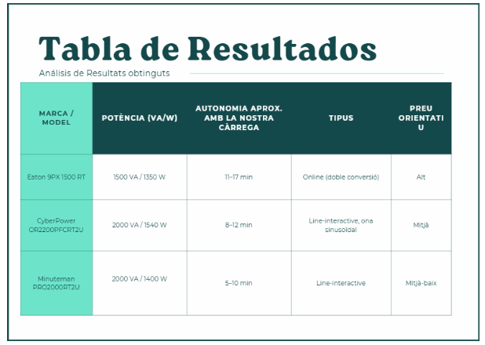

# SMX2B

**Hector Rabasso Lopez**
[alu.hector.rabasso@mataro.epiaedu.cat](mailto:alu.hector.rabasso@mataro.epiaedu.cat)

# T02: Selecció d’un SAI

## 1. Introducció

TecnoGestió S.L. és una petita empresa de gestió documental i assessorament informàtic que disposa de quatre ordinadors de sobretaula, una impressora multifunció i un router d’accés a Internet. Com que es produeixen incidències en el subministrament elèctric, es necessita un SAI que protegeixi els equips essencials i permeti guardar la feina i apagar els ordinadors de manera segura.

Per adaptar l'estudi als requisits de l'activitat, s'han utilitzat equips reals, s'han indicat els valors de consum en W i VA, s'han comparat tres models de SAI amb els seus preus i distribuïdors i, finalment, s'ha seleccionat el model més adequat.

## 2. Inventari dels equips

Per representar l'equipament de l'empresa s'utilitzen models reals. En el cas dels ordinadors, la dada de 240 W correspon a la potència màxima de la font d'alimentació del model HP Pro SFF 400 G9.

| **Dispositiu**         | **Marca i model**   | **Quantitat** |  **W considerats** | **VA considerats** | **Al SAI?** |
| ---------------------- | ------------------- | ------------: | -----------------: | -----------------: | ----------- |
| Ordinador              | HP Pro SFF 400 G9   |             4 |           240 W/u. |          300 VA/u. | Sí          |
| Router                 | TP-Link Archer C6   |             1 |               12 W |              15 VA | Sí          |
| Impressora multifunció | Brother MFC-L2800DW |             1 | 470 W en impressió |             588 VA | No          |

### Impressora multifunció

La Brother MFC-L2800DW pot arribar a consumir 470 W durant la impressió. Connectar-la al SAI augmentaria molt la càrrega i reduiria l'autonomia disponible per als ordinadors.

Per aquest motiu, la impressora no es connectarà al SAI i es connectarà a una presa amb protecció contra sobretensions.

## 3. Càlcul de la potència necessària

### 3.1. Potència dels equips protegits

Els equips que es connectaran al SAI són els quatre ordinadors i el router.

**4 ordinadors:**

4 × 240 W = **960 W**

**Router:**

1 × 12 W = **12 W**

**Consum total connectat al SAI:**

960 W + 12 W = **972 W**

### 3.2. Marge de seguretat del 20 %

Per garantir que el SAI pugui treballar amb marge suficient, afegim un 20 % de reserva:

972 W × 1,20 = **1.166,4 W**

Per tant, necessitem un SAI capaç de proporcionar com a mínim **1.166 W**.

### 3.3. Conversió a VA

Utilitzant un factor de potència de 0,8:

1.166,4 W ÷ 0,8 = **1.458 VA**

Per tant, el SAI ha de tenir com a mínim aproximadament **1.500 VA** i una potència activa superior als **1.166 W** calculats.

Per garantir també l'autonomia necessària, es compararan models de **1500 VA**.

### 3.4. Autonomia mínima

L'empresa necessita que el SAI pugui mantenir els equips funcionant durant un mínim de **10 minuts**. Aquest temps permet guardar la feina i apagar els ordinadors de manera segura en cas d'una incidència elèctrica.

## 4. Comparativa de tres models de SAI

A continuació es comparen tres models reals que superen la potència mínima calculada.

## 5. Selecció del SAI

### Model seleccionat: Minuteman PRO2000RT2U

Després de comparar els tres models, es proposa el **Minuteman PRO2000RT2U** per a TecnoGestió S.L.

Els principals motius són:

* Té una potència de **2000 VA / 1400 W**, superior als aproximadament 1.166 W calculats amb un marge de seguretat.
* La seva autonomia publicada és de **15 minuts a càrrega completa**, superior als 10 minuts mínims requerits.
* Utilitza tecnologia **online de doble conversió** i proporciona una ona sinusoidal pura.
* El preu consultat és de **758,48 €**.
* Disposa de connexions i opcions de gestió que poden ser útils per a una empresa.

La impressora multifunció es mantindrà fora del SAI perquè el seu consum durant la impressió podria reduir considerablement l'autonomia disponible per als ordinadors.

## 6. Conclusions

La càrrega protegida pel SAI és de **972 W**. Aplicant un marge de seguretat del 20 %, obtenim una potència necessària de **1.166,4 W**, que equival aproximadament a **1.458 VA** utilitzant un factor de potència de 0,8.

Per tant, el SAI ha de tenir com a mínim uns **1.500 VA** i superar els **1.166 W** de potència activa.

S'han comparat tres models reals de SAI tenint en compte la potència, el tipus, l'autonomia i el preu. El model proposat és el **Minuteman PRO2000RT2U**, ja que compleix àmpliament els requisits de potència i autonomia establerts per a l'empresa.
